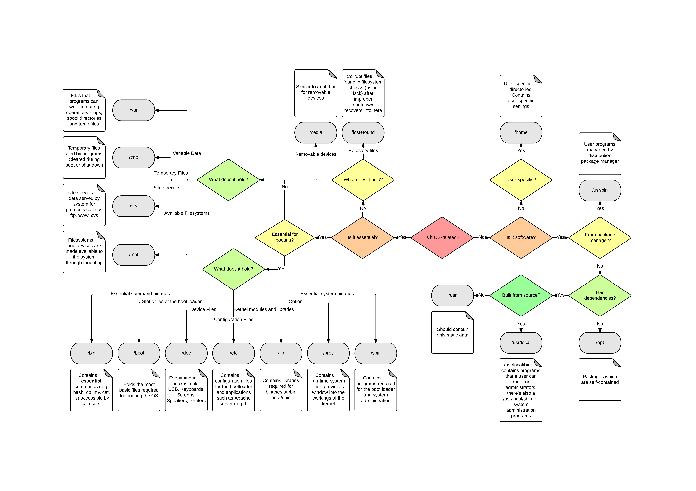

# Scripts, utilities and configuration files

Repository for maintaining and backing up my personalized files.

## Directory guide

I've found an image in [this post's answer](https://askubuntu.com/a/551931) that is helpful for a better understanding
of Unix directories:

As a Linux beginner, I'm learning as I go. Some things I discovered:

- `~/.local/bin/`: Utilities and scripts;
- `~/.local/lib`: Scripts that are not used as commands, but as components of other scripts;
- `/opt/`: Manually installed software, not managed by package managers (e.g., `.jar` applications).

## `.bashrc`

Bash configuration file, should be located in the user home directory (`/home/username/.bashrc` or simply `~/.bashrc`).
Configures the PS1 prompt, aliases, path variables, completions, some tools etc.

As far as I know, this file is sourced by the shell on start-up and its content stays in memory. Therefore, for less used
commands, it's better to create a script and append it to the `PATH` variable. Also, it may be better to create a custom
file instead of modifying this one (e.g., `~/.bashrc.d/custom.sh`).

For changes to take effect the shell must be restarted.

## `inputrc`

This file should be located at `/etc/inputrc`.

I use it to toggle on the insensitive autocompletion and to turn off the (extremely annoying) bell sound.

Same deal as with `.bashrc`: it may be better to create a custom `~/.inputrc` file than to change the system defaults.
